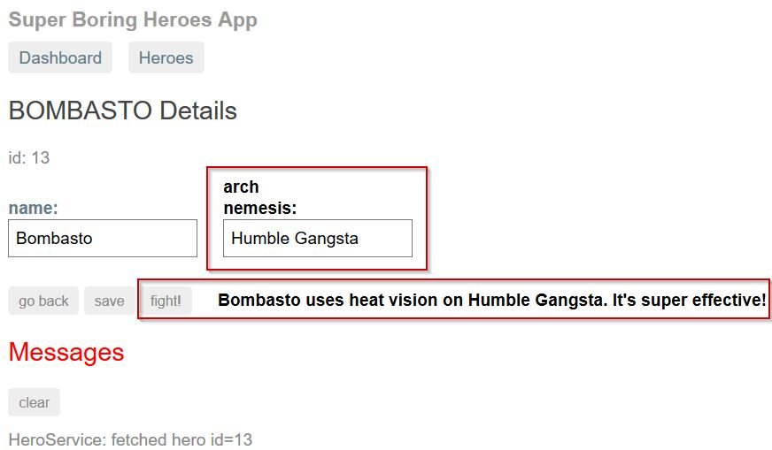
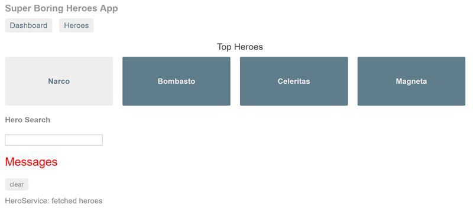
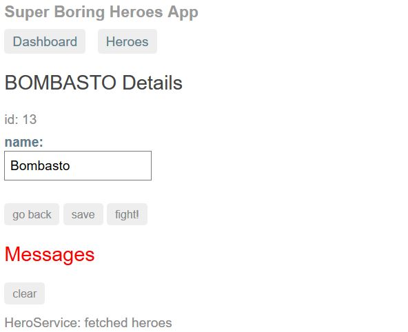
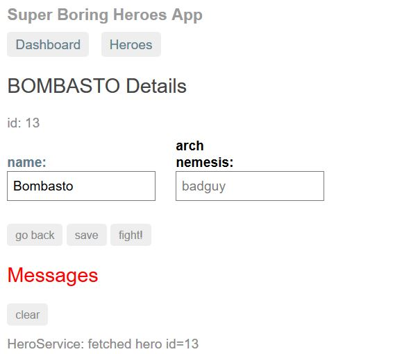

## Introduction

In this tutorial we're going to add a simple feature to an existing Angular application using Elm. Here's what the final version of the app is going to look like:



The bits that are boxed in red are the UI that we're adding for our feature. This is a superhero app, and in its current state the app has no support for villains. The app was initially designed to support Create, Read, Update, and Delete operations (CRUD) on a collection of heroes. But that's not very interesting, so we're gonna spice things up with some villainous Elm!

## Prerequisites: node and the Angular CLI

If you are interested in using Elm with Angular then you've probably already installed these. But if you haven't yet then now is the time. For convenience, here is the command for installing the Angular Command Line Interface (only works if you've already installed nodejs):

```
npm install -g @angular/cli
```

Once you've got the Angular CLI installed, you'll want to restore our project dependencies by running

```
npm install
```

in the directory in which you've cloned the repo for this tutorial. It's gonna take a minute. Lots of dependencies.

## Some stuff that I did before you got here

I wrote all of the Elm code before you got here. Sorry. That is the funnest part, I know. All of our elm code lives in a module named "BadGuy", and I've included the BadGuy source in this repo in case you are interested.

I also added the following properties to compilerOptions in tsconfig.json:

```json
"allowJS": true,
"outDir": "./built",
```

## Getting Started

The first thing I'll have you do is open the files that we'll be working on. In your favorite text editor, open

```
src/app/hero-detail/hero-detail.component.html
```

and

```
src/app/hero-detail/hero-detail.component.ts
```

Next you're going to startup our development server by navigating to the tutorial repository's root directory  (if you're not there already) and running

```
ng serve --open
```

The "open" flag will cause the Angular CLI to open our app in a new browser tab. It's possible that the Angular CLI will report some error relative to overwriting a javascript file. Ignore it. It will go away in just a second when we start changing stuff. Our development server is now running, and it will (usually) rebuild our app and refresh our webpage whenever we save a change.

We'll finish up our setup by editing those hero-detail files we opened earlier. First we'll make an insignificant change to hero-detail.component.ts. You can delete the comment on the first line of the file or make any other change that won't affect the behavior of our app. Save the file. This may not be necessary on your system, but for me this is the best way to stop the Angular CLI from complaining about overwriting compiled-elm.js. Next we'll edit the html file. We are going to add a new sibling for the hero name input:

```html
<div>
    <label>name:
        <input [(ngModel)]="hero.name" placeholder="name"/>
    </label>
    
    <span #elm id="elm-container"></span>
</div>

```

This new span is where we're going to embed our Elm villain.  Uncomment the two elements at the bottom of the html file (a fight button and a span that will contain a fight outcome), and save it. At this point the Angular CLI should not be complaining at you anymore. Refresh the webpage (if necessary), and the app should look like this:



This is our application's homepage, and we're not going to change anything here. Our work will focus exclusively on the hero details component. To see that component in action, click on the "Heroes" button near the top, then click any random hero from the list that appears next. You should now be at the hero details page, which should look like this:



## Ok, We're finally ready to do the Elm interop

There is a simple, two step process for interop with Elm:

1. Embed Elm in your webpage
2. Hook up the ports

Anyone can do it! But before we do, let me point out a couple of important things. Among the imports near the top of our ts file, you'll see one like this:

```typescript
import * as Elm from './compiled-elm.js';
```

It looks a little weird, I know. That's because our compiled Elm is in the form of a commonjs module, but our Angular build process works only with es6 modules. It's not hard to turn your compiled Elm into an es6 module, but the Angular CLI wouldn't cooperate with me, and for the purposes of this tutorial it doesn't really matter. Maybe this is something you can figure out. I'll be glad to update this tutorial and give you credit for finding the way!

Let's look next at the line where we declare the HeroDetailComponent class:

```typescript
export class HeroDetailComponent implements OnInit, AfterViewChecked {
```

As you can see, our component implements AfterViewChecked. We had to do this because the root element of our hero detail component (I'm talking about hero-detail.component.html) contains an ngIf directive. Because of this ngIf our hero detail component isn't going to be rendered right away. The hero detail elements will be added to our page some time after our hero detail component retrieves a relevant hero from the hero service. In other words, the hero detail component's hero is initially null, and you cannot display a null hero. I am not the one that designed this heroes app. I lifted it straight from the Angular website. Having the ngIf makes this tutorial a little more complicated, but it's valuable in that it gives us a feel for what it would be like to mix Elm with Angular in the real world. In order to successfully mix Elm with Angular in the real world, you need to know Angular well. If you don't know about the Angular lifecycle hooks, then you are going to struggle.

Scroll down to the ngAfterViewChecked function. Right now it is empty. We are going to add an implementation that will initialize Elm:

```typescript
ngAfterViewChecked() {
    if (!this.elmApp && this.elmContainer) {
        this.initializeElm();
    }
}
```

elmApp and elmContainer are properties that I added to the hero detail component before you got here. Hopefully the names are self-documenting. The initializeElm function is not yet defined, so let's do that next. We will start with an implementation that embeds Elm inside our hero detail component. If you recall, this is step 1 of our two step interop process.

```typescript
initializeElm() {
    const heroDetailComponent = this;
                                                                   
    this.elmApp = Elm.BadGuy.embed(this.elmContainer.nativeElement);
}
```

Once you've saved, our hero details page should look like this (building and refreshing should have happened automagically):



Well it's about time the bad guy showed up! But we're not finished yet. We can enter a name for the bad guy, but it won't get saved (try it). And if we click the fight button we'll see that our hero is currently fighting with undefined. As good as it might feel to use heat vision on undefined, the hero ought to be fighting his (or her) arch nemesis. We need to press on to step 2 in our two step interop process - it's time to hook up the ports!

## Hooking up the ports

We'll hook up the ports in our initializeElm function, right below the spot where we called embed. We are going to have 2 ports: one for sending the villain name into Elm when we initialize the hero details component, and another for sending the changed villain name from Elm out to Angular. We'll start with the port for sending the initial villain name into Elm:

```typescript
initializeElm() {
    const heroDetailComponent = this;
                                                                   
    this.elmApp = Elm.BadGuy.embed(this.elmContainer.nativeElement);
    
    this.elmApp.ports.names.send(this.hero.archNemesis || "");
}
```

names is a port I defined for sending villain names into Elm. names is an incoming port (relative to Elm), and my convention for incoming ports is to name them after the type of data that they accept. For incoming ports, you always pass data by calling send.

Let's move on to our second port - the one for sending updated villain names out to Angular:

```typescript
initializeElm() {
    const heroDetailComponent = this;
                                                                   
    this.elmApp = Elm.BadGuy.embed(this.elmContainer.nativeElement);
    
    this.elmApp.ports.names.send(this.hero.archNemesis || "");
    
    this.elmApp.ports.saveName.subscribe(function(name) {
        heroDetailComponent.hero.archNemesis = name;
    });
}
```

saveName is a port I defined for sending the updated villain name out of Elm. My convention for outgoing ports (outgoing relative to Elm) is to give them command-like names. For outgoing ports, you always receive data by calling subscribe.

Once your initializeElm function looks like the one above, save it. You should now have fully functional bad guys. Their names should be persisted (don't forget to hit the save button), and your heroes should be able to fight them. The feature is done - go bad guys!

## What did we learn?

Hopefully we learned that interoperating with Elm is straightforward. Elm was designed to make interop with javascript simple. Once you know the two step formula you can follow it anywhere and be a huge success!

But you'd better be real comfortable with your Angular. As we saw in this tutorial, embedding Elm could have been quite a struggle if we'd been unaware of ngIf and the Angular lifecycle hooks. The same goes for any other framework or library where you're trying to graft Elm. The better you know the mother tech, the better you can incorporate Elm.

## What's next?

Honestly, I don't know. Would you like to see an example of interop between Elm and some other framework or library? Drop me a line, and I'll see what I can do!